# RealEstate Marketplace Application 

A full-fledged RealEstate Marketplace built using the MERN stack (MongoDB, Express.js, React, and Node.js).

## Table of Contents

- [Overview](#overview)
- [Features](#features)
- [Screenshots](#screenshots)
- [Installation](#installation)
- [Usage](#usage)

## Overview

This project is a RealEstate Marketplace web application that allows users to buy, sell, and rent properties. It features a user-friendly interface, secure authentication, and a robust backend for managing property listings.

## Features

- User Authentication (Login/Register)
- Property Listings (Buy, Sell, Rent)
- Agent Profiles
- Dashboard for managing listings
- Search and Filter properties
- Detailed property view with related properties

## Screenshots

### Home Page
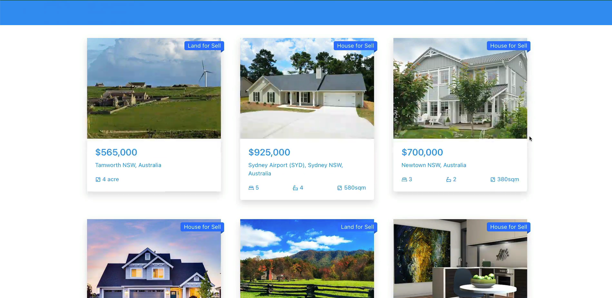

### Login Page
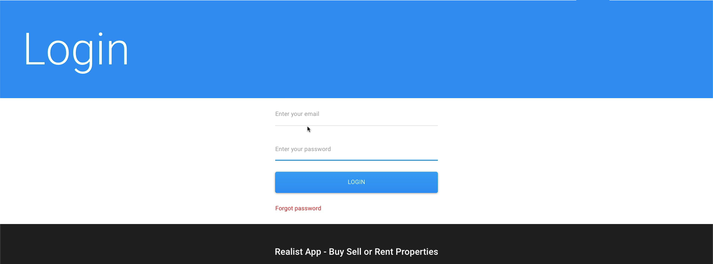

### Agent Page
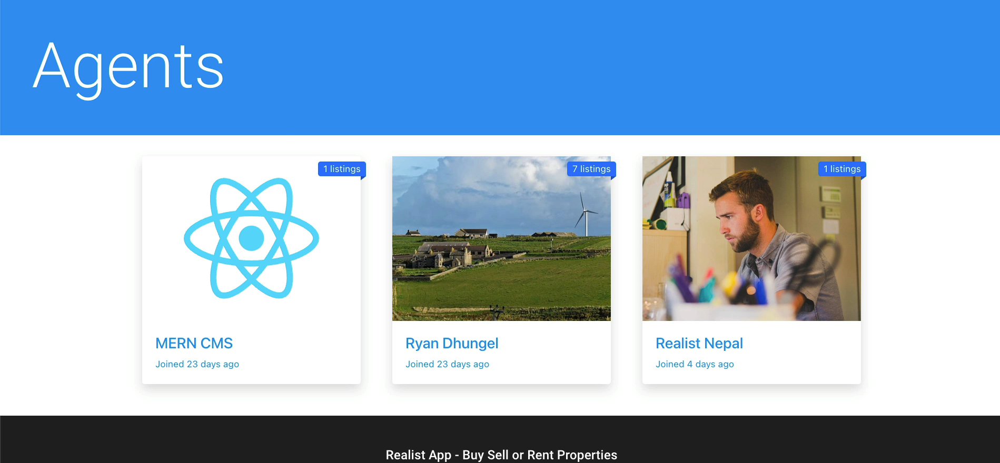

### Create Ad Page
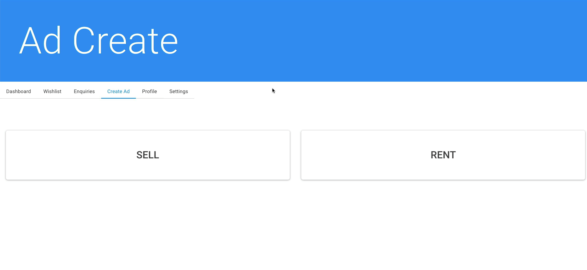
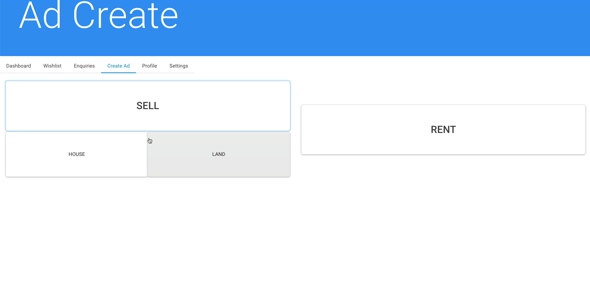
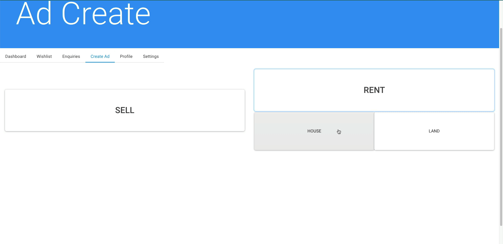

### Dashboard
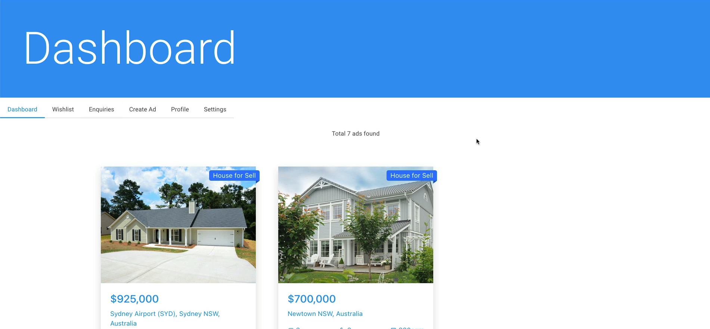

### For Rent Page
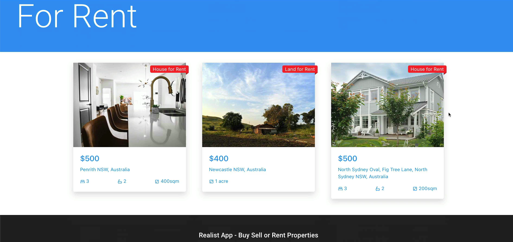

### For Sell Page
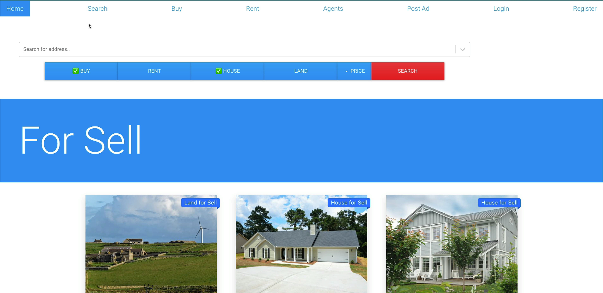

### Property Overview
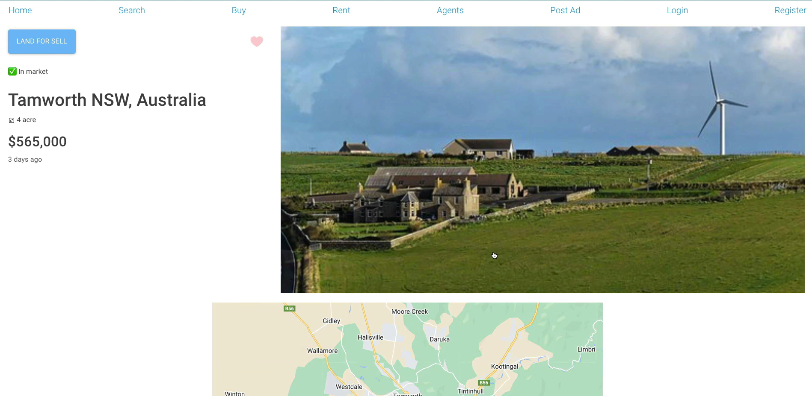
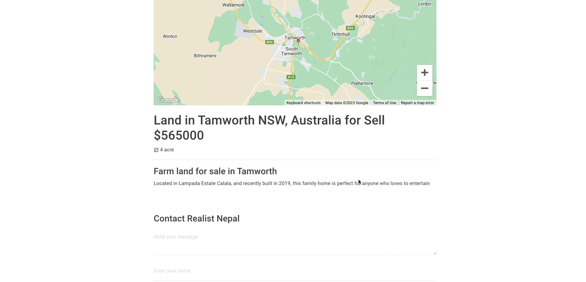
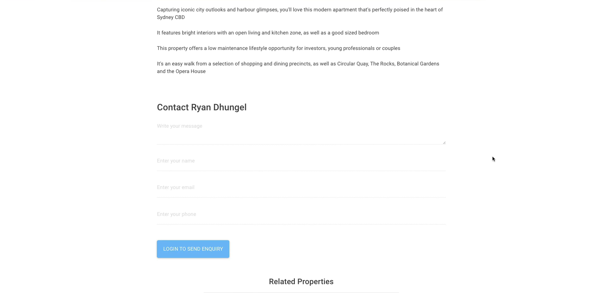

### Related Products
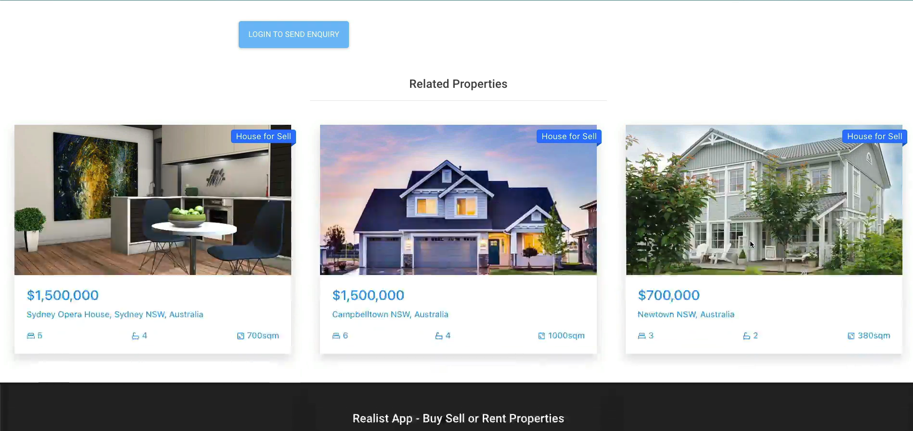

## Installation

1. Clone the repository:
   ```bash
   git clone https://github.com/Sai-Chakradhar-Mahendrakar/Real-Estate-Marketplace-app-using-MERN-Stack.git ```

2. Navigate to the project directory:
   ```bash
   cd Real-Estate-Marketplace-app-using-MERN-Stack ```

3. Install server dependencies:
   ```bash
   cd server
   npm install ```

4. Install client dependencies:
   ```bash
   cd ../client
   npm install ```

5. server `config.js`

```bash
import SES from "aws-sdk/clients/ses.js";
import S3 from "aws-sdk/clients/s3.js";
import NodeGeocoder from "node-geocoder";

export const DATABASE = "mongodb://127.0.0.1:27017/xxx";

export const AWS_ACCESS_KEY_ID = "xxx";
export const AWS_SECRET_ACCESS_KEY = "xxx/xxx";

export const EMAIL_FROM = '"Name" <xxx@xx.x>';
export const REPLY_TO = "xxx@xx.x";

const awsConfig = {
  accessKeyId: AWS_ACCESS_KEY_ID,
  secretAccessKey: AWS_SECRET_ACCESS_KEY,
  region: "us-east-1",
  apiVersion: "2010-12-01",
};
export const AWSSES = new SES(awsConfig);
export const AWSS3 = new S3(awsConfig);

const options = {
  provider: "google",
  apiKey: "xxx",
  formatter: null,
};

export const GOOGLE_GEOCODER = NodeGeocoder(options);

export const JWT_SECRET = "xxx";
export const CLIENT_URL = "http://localhost:3000";

```

6. client `config.js`

```bash
export const API = "http://localhost:8000/api";
export const GOOGLE_PLACES_KEY = "xxx";
export const GOOGLE_MAPS_KEY = "xxx-xxx";
```

## Usage

1. Start the server:
   ```bash
   cd server
   npm run dev ```

2. Start the client::
   ```bash
   cd ../client
   npm start```
   
The application should now be running on <b>http://localhost:3000</b>.

